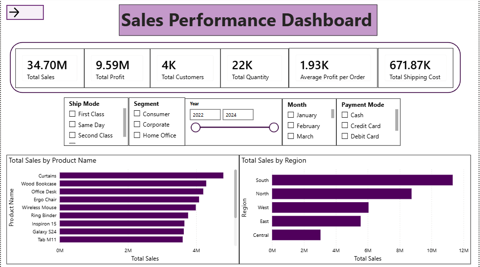
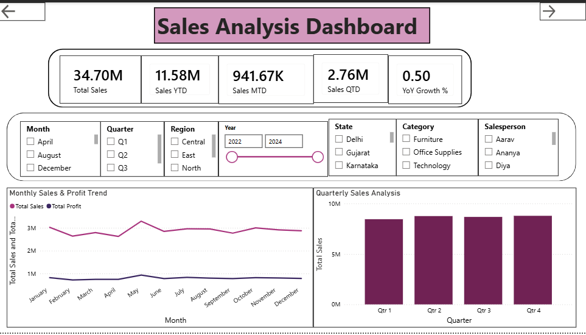

# 📊 Sales Performance Dashboard | Power BI

## 📌 Project Overview

This project is an interactive **Sales Performance and Business Intelligence Dashboard** developed using Microsoft Power BI.

The dashboard analyzes **50,000+ sales records** to provide insights into sales performance, product performance, regional trends, profitability, shipping performance, delivery performance, and operational efficiency.

The project demonstrates practical skills in:

- Power BI
- DAX
- Power Query
- Data Modeling
- Time Intelligence
- Data Visualization
- Business Intelligence

---

## 🛠️ Tools & Technologies

- Microsoft Power BI
- DAX
- Power Query
- Microsoft Excel
- Data Modeling
- Time Intelligence
- Interactive Data Visualization

---

# 📊 Dashboard Pages

## 1. Executive Dashboard

The Executive Dashboard provides a high-level overview of overall business performance.

### Key KPIs

- Total Sales
- Total Profit
- Total Customers
- Total Quantity
- Average Profit per Order
- Total Shipping Cost

### Visual Analysis

- Total Sales by Product
- Total Sales by Region
- Total Sales by Category
- Total Sales by State
- Monthly Sales & Profit Trend

### Business Purpose

This dashboard helps users quickly understand overall sales performance and identify important business trends.

---

## 2. Sales Analysis Dashboard

The Sales Analysis Dashboard focuses on sales performance across different time periods, regions, states, categories, and salespersons.

### Key KPIs

- Total Sales
- Sales YTD
- Sales MTD
- Sales QTD
- YoY Growth %

### Visual Analysis

- Monthly Sales & Profit Trend
- Quarterly Sales Analysis
- Yearly Sales Trend
- Total Sales by State
- Total Sales by Region
- Total Sales by Salesperson

### Interactive Filters

- Month
- Quarter
- Region
- Year
- State
- Category
- Salesperson

### Business Purpose

This dashboard helps identify sales trends, strong-performing regions, salespersons, and changes in performance over time.

---

## 3. Product Analysis Dashboard

The Product Analysis Dashboard focuses on product, category, sub-category, brand, profitability, customer ratings, and discount performance.

### Key KPIs

- Total Products
- Total Sales
- Total Profit
- Total Quantity
- Average Rating
- Average Discount
- Profit Margin %

### Visual Analysis

- Total Sales by Product
- Total Sales by Sub-Category
- Total Sales by Category
- Total Sales by Brand
- Product Profit Analysis
- Discount Analysis

### Interactive Filters

- Month
- Sub-Category
- Category
- Year
- State
- Region
- Brand

### Business Purpose

This dashboard helps identify top-performing products, profitable categories, high-performing brands, and the impact of discounts on sales.

---

## 4. Operations Analysis Dashboard

The Operations Analysis Dashboard focuses on order fulfillment, delivery, shipping, warehouse performance, and returns.

### Key KPIs

- Total Orders
- Average Delivery Days
- Total Shipping Cost
- On-Time Delivery %
- Average Shipping Cost
- Returned Orders
- Return Rate %

### Visual Analysis

- Order Priority Analysis
- Warehouse Performance
- Delivery Days Trend
- Total Shipping Cost by Region
- Orders by Shipping Mode
- Returns Analysis
- Total Orders by Delivery Status

### Interactive Filters

- Warehouse
- Region
- Month
- Year
- Ship Mode
- Order Priority
- Delivery Status

### Business Purpose

This dashboard helps monitor operational efficiency, delivery performance, shipping costs, warehouse performance, and return patterns.

---

# 🧮 DAX Measures & Time Intelligence

The project uses DAX measures to calculate business KPIs and perform time-based analysis.

## Total Sales

```DAX
Total Sales =
SUM(FactSales[Sales])
```

## Total Profit

```DAX
Total Profit =
SUM(FactSales[Profit])
```

## Total Orders

```DAX
Total Orders =
DISTINCTCOUNT(FactSales[Order ID])
```

## Total Customers

```DAX
Total Customers =
DISTINCTCOUNT(FactSales[Customer ID])
```

## Average Profit per Order

```DAX
Average Profit per Order =
DIVIDE(
    [Total Profit],
    [Total Orders]
)
```

## Profit Margin %

```DAX
Profit Margin % =
DIVIDE(
    [Total Profit],
    [Total Sales]
)
```

## Sales YTD

```DAX
Sales YTD =
TOTALYTD(
    [Total Sales],
    Calendar[Date]
)
```

## Sales MTD

```DAX
Sales MTD =
TOTALMTD(
    [Total Sales],
    Calendar[Date]
)
```

## Sales QTD

```DAX
Sales QTD =
TOTALQTD(
    [Total Sales],
    Calendar[Date]
)
```

## Previous Year Sales

```DAX
Previous Year Sales =
CALCULATE(
    [Total Sales],
    SAMEPERIODLASTYEAR(Calendar[Date])
)
```

## YoY Growth %

```DAX
YoY Growth % =
DIVIDE(
    [Total Sales] - [Previous Year Sales],
    [Previous Year Sales]
)
```

---

# 📸 Dashboard Screenshots

## Executive Dashboard



## Executive Dashboard - Additional Page

.png)

## Sales Analysis Dashboard



## Sales Analysis Dashboard - Additional Page

.png)

## Product Analysis Dashboard


## Product Analysis Dashboard - Additional Page

.png)

## Operations Analysis Dashboard


## Operations Analysis Dashboard - Additional Page

.png)
